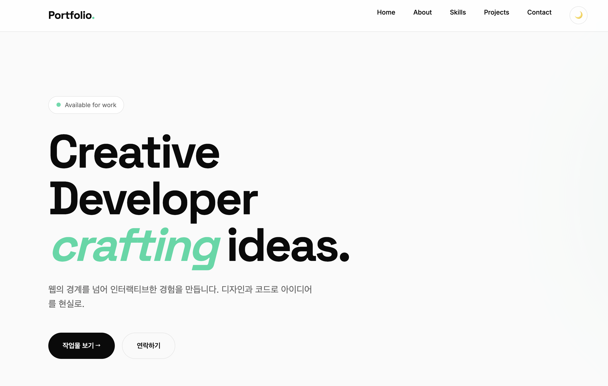
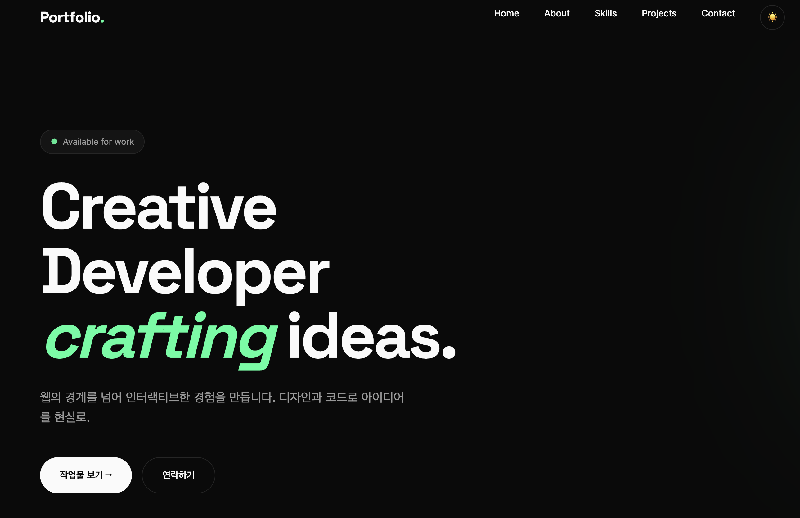
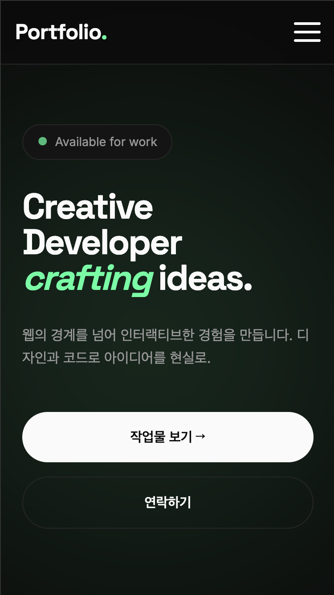

# Vanilla JS Portfolio

순수 HTML, CSS, JavaScript로 제작한 반응형 포트폴리오 웹사이트입니다.  
시맨틱 마크업, 반응형 레이아웃, 다크 모드, GitHub API 연동, 폼 유효성 검사 등  
프론트엔드 기본기를 종합적으로 담은 프로젝트입니다.

---

## 배포 링크

🔗 **Live Demo**  
https://choijiwonj.github.io/portfolio/

---

## GitHub Repository

🔗 **Repository**  
https://github.com/본인아이디/레포이름

---

## 스크린샷

### 데스크톱 화면


### 다크모드 화면


### 모바일 화면


## 프로젝트 소개

이 프로젝트는 **순수 JavaScript 기반 포트폴리오 사이트**입니다.  
프레임워크 없이 직접 DOM 조작, 이벤트 처리, 상태 변경, API 연동을 구현했습니다.

특히 다음 사항에 집중했습니다.

- 시맨틱한 HTML 구조
- 모바일 퍼스트 반응형 레이아웃
- 다크 모드 + localStorage 저장
- GitHub API를 이용한 프로젝트 자동 렌더링
- 사용자 친화적인 폼 UX 및 실시간 유효성 검사
- 상태 변화에 따라 UI가 달라지는 렌더링 구조

---

## 주요 기능

### 1. 시맨틱 마크업 기반 구조
다음 시맨틱 태그를 사용해 페이지를 구성했습니다.

- `<header>`
- `<nav>`
- `<main>`
- `<section>`
- `<article>`
- `<footer>`

포함된 섹션:

- Hero
- About
- Skills
- Projects
- Contact
- Footer

또한,
- 네비게이션 앵커 링크로 각 섹션 이동 가능
- 모든 이미지에 `alt` 속성 부여
- 폼 요소에 `label`과 `for/id` 연결 적용

---

### 2. 반응형 레이아웃
모바일 퍼스트 방식으로 제작했습니다.

#### 브레이크포인트
- **768px**: 태블릿
- **1024px**: 데스크톱

#### 레이아웃 구현 방식
- **네비게이션**: Flexbox
- **프로젝트 카드**: CSS Grid (`auto-fit`, `minmax()`)

#### 모바일 UI
- 모바일에서는 기본 메뉴를 숨기고
- **햄버거 버튼 클릭 시 메뉴가 열리고 닫히도록 구현**

---

### 3. 다크 모드
- 다크 모드 토글 버튼 클릭 시 테마 변경
- `data-theme="dark"` 기반으로 CSS 변수 전환
- 선택한 테마는 `localStorage`에 저장되어
  **새로고침 후에도 유지**됩니다.

---

### 4. 인터랙션
다음 인터랙션을 구현했습니다.

- **햄버거 메뉴 토글**
- **부드러운 스크롤 이동**
- **스크롤 탑 버튼**
  - 스크롤 **300px 이상**일 때 표시
- **네비게이션 스타일 변경**
  - 스크롤 **60px 이상**일 때 배경 스타일 변경
- **스크롤 애니메이션**
  - `IntersectionObserver` 사용
  - `threshold: 0.2` 기준으로 요소 등장 애니메이션 적용

---

### 5. Contact 폼 UX
문의 폼(모달 기반)을 구현했습니다.

#### 입력 항목
- 이름
- 이메일
- 제목
- 문의 유형
- 메시지

#### 적용 기능
- 필수값 검증
- 이메일 형식 검증
- 실시간 유효성 검사
- 에러 메시지 표시
- 글자 수 카운터
- 제출 시 기본 동작 방지 (`event.preventDefault()`)
- 성공 메시지 표시
- 성공 후 자동 닫힘 처리

---

### 6. GitHub API 연동
GitHub API를 사용해 저장소 목록을 불러와 Projects 섹션에 렌더링했습니다.

#### 사용 API
```bash
https://api.github.com/users/{본인아이디}/repos